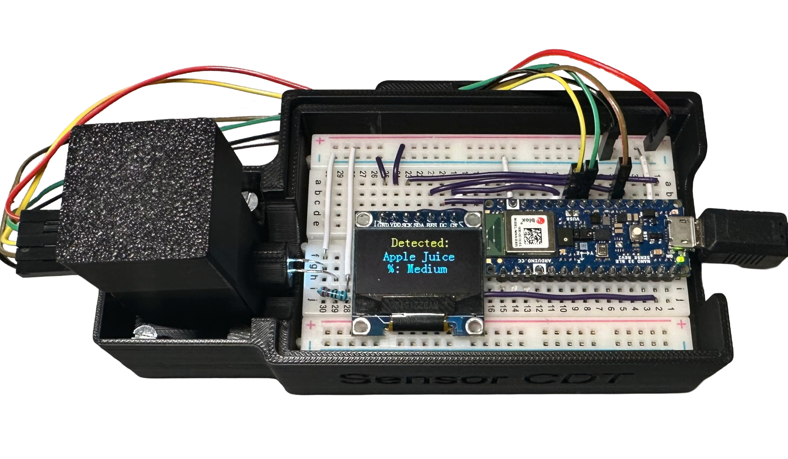
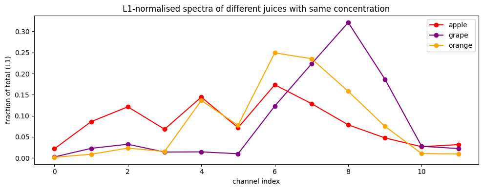
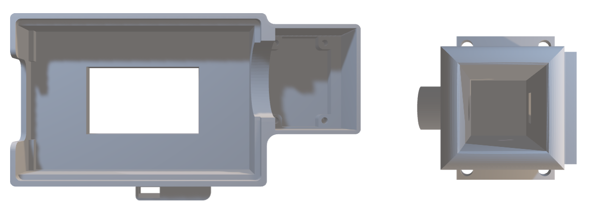

# SensorCDT Spectrophotometer Cousework
Low-cost Spectrophotometer for Juice Classification
===================================================================================

In this work, we present a 3D-printed reproducible spectrophotometer system integrating an Arduino MCU with AS7343 spectral sensor. 12-channel raw measurements are pre-processed and used to train machine learning models for juice type and concentration classification. Based on the performance on an independent test set, the best two models achieve a test accuracy of 100% for juice type classification, and 82.35% for concentration classification.

<p align="center">
  
</p>

Example Readout:

<p align="center">
  
</p>


Mechanical Assembly
-------------------

3D assembly reference image:

<p align="center">
  
</p>


The mechanical enclosure consists of three 3D-printed components located in the
STL folder.

Assembly steps:
1. Print all three STL files from the STL folder.
2. Use PLA filament.
3. Suggested print settings:
   - Layer height: 0.2 mm
   - Infill: 20–30%
   - Supports: not required
4. Assemble the enclosure using the screws listed below.

### Required Fasteners

- 4 × M3 screws
- 2 × M2 screws


Electrical Connections 
-------------------------------

### Pinout (Arduino Nano 33 BLE Sense Rev2)

| Module | Signal | Arduino Pin |
|-------|--------|-------------|
| OLED (SSD1306) | SCK | D13 |
| OLED (SSD1306) | SDA | D11 |
| OLED (SSD1306) | RES | A0 |
| OLED (SSD1306) | DC  | A7 |
| OLED (SSD1306) | CS  | A6 |
| AS7343 | SDA | A4 |
| AS7343 | SCL | A5 |
| AS7343 | INT | A1 |

Ensure all modules share a common ground (GND) and correct supply voltage 3.3V.


Firmware Setup
--------------

The firmware is developed using PlatformIO with Visual Studio Code.

Requirements:
- Visual Studio Code
- PlatformIO extension
- Arduino Nano 33 BLE Sense Rev2

Setup steps:
1. Open the Firmware folder in Visual Studio Code.
2. Ensure PlatformIO detects the correct board.
3. Install required libraries specified in platformio.ini.
4. Build and upload the firmware.
5. Open the serial monitor at 115200 baud.


PC-Side Software
----------------

Python scripts for data acquisition, machine learning inference, and evaluation are located in the PC folder.

Install required dependencies using:

```
pip install -r requirements.txt
```

Bill of Materials (BOM)
----------------------

No | Item        | Description                                   | Price (£) | Qty | Total (£) | Source
---|-------------|-----------------------------------------------|-----------|-----|-----------|-------------------------
1  | OLED        | 0.96” SSD1306 OLED display module              | 4.00      | 1   | 4.00      | https://www.adafruit.com
2  | Arduino MCU | Arduino Nano 33 BLE Sense Rev2                 | 37.81     | 1   | 37.81     | https://store.arduino.cc
3  | AS7343      | Pimoroni AS7343 multi-spectral sensor          | 18.90     | 1   | 18.90     | https://shop.pimoroni.com
4  | PLA         | PLA filament, 1.75 mm (50 g)                   | 1.00      | 1   | 1.00      | https://www.amazon.co.uk
5  | White LED   | White 5 mm LED                                 | 0.27      | 1   | 0.27      | https://www.amazon.co.uk
6  | Resistor    | 220 Ω resistor                                 | 0.04      | 1   | 0.04      | https://www.amazon.co.uk
7  | Wire        | Jumper wires                                   | 0.07      | 5   | 0.35      | https://www.amazon.co.uk
8  | Breadboard  | Solderless breadboard                          | 4.95      | 1   | 4.95      | https://www.amazon.co.uk

Total cost: £67.32


Troubleshooting Guide
---------------------

No serial output:
- Check baud rate is set to 115200.
- Verify USB cable supports data transfer.
- Confirm correct COM/USB port is selected.

OLED display not working:
- Verify SPI pin connections.
- Check OLED library compatibility.

Spectral sensor not detected:
- Verify I2C wiring (SDA/SCL).
- Check sensor address and power supply.

Inconsistent readings:
- Minimize ambient light interference.

License
-------

This project is released under the MIT License.
